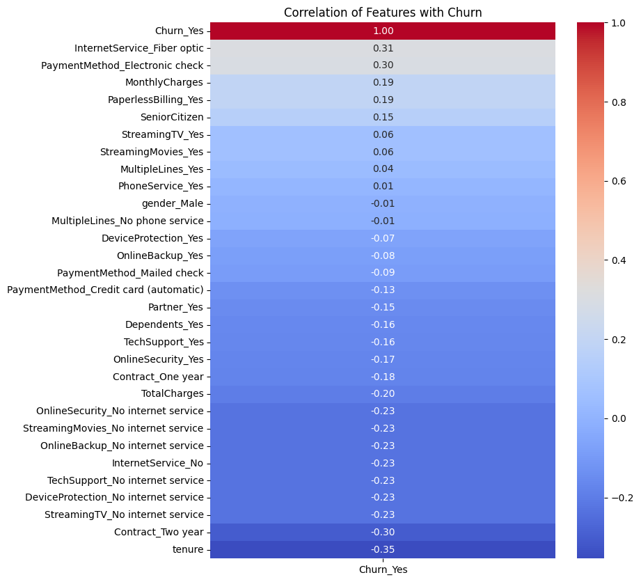
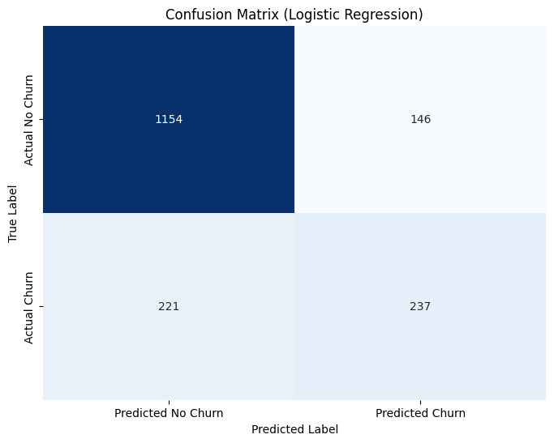

# Telco Customer Churn Analysis

This repository contains data and code used to analyze customer churn for a telecommunications company. The project involves data exploration, preprocessing, model training, and evaluation using machine learning techniques.

## Project Structure

```
- telco_customer_churn.ipynb (Jupyter notebook with full analysis)
- Telco-Customer-Churn.csv (Raw dataset)
- README.md (Project documentation)
- requirements.txt (dependencies)
```

## Project Overview

This project aims to understand the factors that lead to customer churn and build predictive models to help the business mitigate future churn. It includes:

* Exploratory Data Analysis (EDA)
* Data cleaning and feature engineering
* Building machine learning models
* Model evaluation and comparison

## Dataset

**File:** `Telco-Customer-Churn.csv`

The dataset includes customer demographics, account details, service usage, and whether the customer churned. Key columns include:

* `gender`, `SeniorCitizen`, `Partner`, `Dependents`
* `tenure`, `PhoneService`, `InternetService`
* `Contract`, `PaymentMethod`, `MonthlyCharges`, `TotalCharges`
* `Churn` (target variable)

## Notebook

The main notebook (`telco_customer_churn.ipynb`) walks through:

1. Importing libraries and loading the dataset
2. Cleaning and preprocessing
3. Visualizing churn trends
4. Encoding categorical variables
5. Building models (Logistic Regression, Random Forest, etc.)
6. Comparing accuracy and other metrics

## Installation

To run the project locally:

```bash
# Clone the repository
git clone <your-repo-url>
cd <repo-folder>

# Create and activate virtual environment
python -m venv venv
source venv/bin/activate (Linux/Mac)
venv\Scripts\activate (Windows)

# Install dependencies
pip install -r requirements.txt
```

## Dependencies

Common dependencies include:

* pandas
* numpy
* matplotlib / seaborn
* scikit-learn
* jupyter

## Results

Models are evaluated using:

* Accuracy
* Precision & recall
* Confusion matrix
* ROC-AUC

Insights from the analysis help identify which customer groups are at a higher risk of churn.




## Contributing

Pull requests are welcome. For major changes, please open an issue first to discuss what you'd like to change.

## License

This project is licensed under the MIT License.

